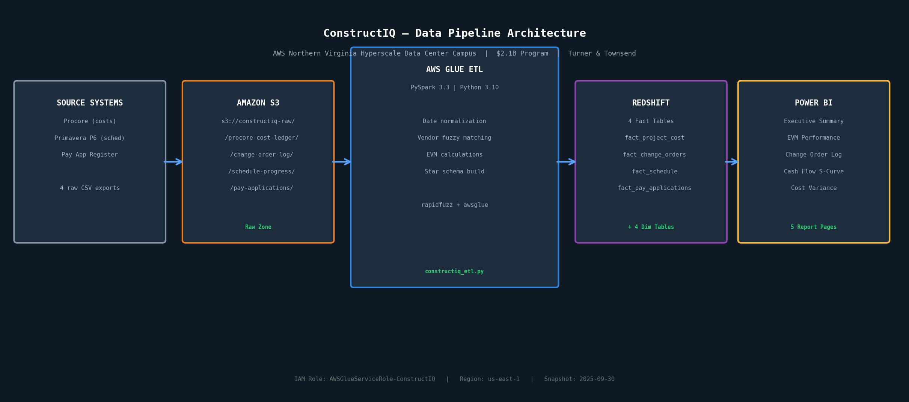

# ConstructIQ — Hyperscale Data Center Cost Control Pipeline

> End-to-end data engineering and analytics pipeline for a $2.1B, 200MW AWS data center campus in Northern Virginia. Built to mirror the project controls workflow Turner & Townsend delivers on hyperscale programs.

---

## The Problem This Solves

Managing a $2.1 billion construction program across four simultaneous buildings means data coming from multiple source systems — Procore for costs, Primavera P6 for schedule, pay application registers — all in different formats, on different export schedules, with different naming conventions for the same vendors.

Without a pipeline, project controls analysts spend their week manually cleaning spreadsheets instead of advising the client. By the time the data is clean, it's already stale.

ConstructIQ automates the entire data flow: raw exports land in S3, the Glue ETL normalizes and transforms them overnight, and the Power BI dashboard is ready for the Monday morning program review — with CPI, SPI, and cash flow S-curves updated automatically.

**What the client gets:** A single dashboard that tells their program director, for each of the four buildings: are we on budget, are we on schedule, and where exactly is the pressure coming from?

---

## Client Context

| | |
|---|---|
| **Client** | Amazon Web Services |
| **Program** | Northern Virginia Hyperscale Data Center Campus |
| **Program Value** | $2.1 billion |
| **Capacity** | 200 MW IT load |
| **Buildings** | BLD-A (Alpha), BLD-B (Beta), BLD-C (Gamma), BLD-D (Delta) |
| **Snapshot Date** | September 30, 2025 |
| **Program Manager** | Turner & Townsend |

The fictional scenario mirrors real hyperscale programs in Loudoun County, Virginia — the world's largest data center market. AWS pre-sells capacity to enterprise customers years in advance, which means schedule slippage or cost overrun at this scale has direct revenue consequences for the client.

**BLD-C is the problem building.** With a CPI of 0.868, for every dollar spent on Gamma, only $0.87 of budgeted work is being delivered. Left unaddressed, the building finishes $110M over its $723M budget. The dashboard surfaces this immediately so the T&T team can escalate corrective action.

---

## Dashboard Decisions Enabled

| Report Page | Decision It Enables |
|---|---|
| Executive Summary | Which buildings need immediate attention this week? |
| EVM Performance | Is cost/schedule trending better or worse month-over-month? |
| Change Order Log | Which open COs represent the largest unresolved cost exposure? |
| Cash Flow | Is program draw-down tracking to the finance team's S-curve baseline? |
| Cost Variance Drill-Through | Which specific work packages are driving the overrun on BLD-C? |

---

## Pipeline Architecture



```
Source Systems → S3 (raw CSVs) → AWS Glue ETL (PySpark) → Redshift Serverless → Power BI
```

---

## Tech Stack

| Layer | Technology | Purpose |
|---|---|---|
| Storage | Amazon S3 | Raw CSV landing zone and Glue script hosting |
| Compute | AWS Glue 4.0 (Spark 3.3) | Managed PySpark ETL — no cluster management |
| Fuzzy matching | rapidfuzz 3.9.3 | Vendor name standardization across source systems |
| Database | Amazon Redshift Serverless | Analytical warehouse — Power BI query target |
| Visualization | Power BI Desktop | Executive dashboards with DAX measures |
| IaC / Config | AWS IAM, Glue Data Catalog | Role-based access, connection management |
| Language | Python 3.10 / PySpark | ETL logic, EVM calculations |
| Version control | Git / GitHub | Full pipeline history |

---

## Repository Structure

```
constructiq-data-center-analytics/
├── README.md
├── architecture/
│   └── pipeline_diagram.png        # End-to-end pipeline diagram
├── data-generation/
│   ├── generate_raw_data.py        # Script that generated the raw CSVs
│   └── raw/                        # Four raw CSV files (simulated source exports)
├── glue-etl/
│   ├── constructiq_etl.py          # Main ETL script — 9 sections, 8 output tables
│   ├── pyrightconfig.json          # Pyright config — awsglue stubs for local dev
│   ├── requirements.txt            # pyspark, rapidfuzz
│   └── stubs/awsglue/              # Local type stubs (awsglue is runtime-only)
├── sql/
│   ├── evm_summary_by_building.sql
│   ├── change_order_aging.sql
│   ├── cash_flow_forecast.sql
│   ├── pay_app_reconciliation.sql
│   └── cost_variance_by_wbs.sql
├── powerbi/
│   └── screenshots/                # Dashboard screenshots
└── docs/
    ├── evm_methodology.md          # EVM concepts, formulas, and answer key
    ├── client_scenario.md          # Fictional AWS program brief
    └── data_dictionary.md          # All 8 tables documented field by field
```

---

## ETL: What the Glue Job Does

The script (`glue-etl/constructiq_etl.py`) runs in 9 sections:

1. **Initialize** — Spark context, Glue job, credentials from Glue Data Catalog (no hardcoded secrets)
2. **Extract** — Reads 4 CSVs from S3 into Spark DataFrames with row count logging
3. **Date normalization** — `F.coalesce()` across 6 date format patterns handles all source system inconsistencies
4. **NULL handling** — Sentinel date `9999-12-31` for pending CO approved dates; variance back-filled where missing
5. **Vendor fuzzy matching** — rapidfuzz UDF with 85-score threshold standardizes vendor names across Procore and pay app data
6. **EVM calculations** — CPI, SPI, EAC, VAC, cost variance % derived from base metrics; division-by-zero guards on all ratios
7. **Fact DataFrames** — 4 clean star schema facts with explicit casting and column renaming
8. **Dimension DataFrames** — `dim_building`, `dim_wbs`, `dim_vendor`, `dim_date` (daily spine 2023–2026)
9. **Load** — JDBC write to Redshift, `mode="overwrite"`, all 8 tables in one loop

---

## The Intentional Data Messiness

The raw CSVs simulate real problems from source system exports — the kind that break naive pipelines:

| Problem | Where | ETL Solution |
|---|---|---|
| 4 different date formats | All files | `F.coalesce()` cascade across `to_date()` patterns |
| Vendor name drift across systems | Cost ledger ↔ pay apps | rapidfuzz `token_sort_ratio` ≥ 85 → canonical name |
| Null `approved_date` on pending COs | Change orders | Sentinel `9999-12-31`; excluded from aging buckets |
| Missing variance on 6% of rows | Cost ledger | Back-filled as `approved_budget - forecasted_final_cost` |
| Cumulative pay app totals | Pay applications | `MAX(period_sequence)` per contractor per building |

---

## EVM Answer Key

When the pipeline runs correctly, querying `fact_project_cost` grouped by `building_id` should produce results close to:

| Building | CPI | SPI | EAC | Status |
|---|---|---|---|---|
| BLD-A (Alpha) | 0.909 | ~1.00 | ~$840M | Over budget |
| BLD-B (Beta) | 1.025 | 0.988 | ~$711M | Healthy |
| BLD-C (Gamma) | **0.868** | ~0.99 | ~$833M | **Critical — most at-risk** |
| BLD-D (Delta) | 1.010 | 1.003 | ~$597M | On track |

Use `sql/evm_summary_by_building.sql` to validate against these numbers after the Glue job runs.

---

## How to Run Locally

```bash
# Install dependencies
pip install -r glue-etl/requirements.txt

# Generate raw data (already committed, but can be regenerated)
python data-generation/generate_raw_data.py
```

The Glue job itself (`constructiq_etl.py`) requires the AWS Glue runtime environment and cannot be executed locally as-is. The `stubs/awsglue/` directory and `pyrightconfig.json` allow local type checking without the runtime.

To run the full pipeline on AWS:
1. Upload `constructiq_etl.py` to `s3://constructiq-raw/scripts/`
2. Create a Glue job pointing to that script with IAM role `AWSGlueServiceRole-ConstructIQ`
3. Set job parameter `--additional-python-modules = rapidfuzz==3.9.3`
4. Configure a Glue connection to Redshift Serverless named `constructiq-redshift`
5. Run the job — all 8 tables load in a single execution

---

## About This Project

Built by David Nguyen as a pre-employment portfolio piece ahead of joining Turner & Townsend as a Project Analyst, Digital on August 10, 2026. The architecture, domain logic, and data quality challenges reflect real hyperscale data center program delivery work.

*Turner & Townsend is a global professional services company specializing in program management, cost management, and project management for major capital programs.*
